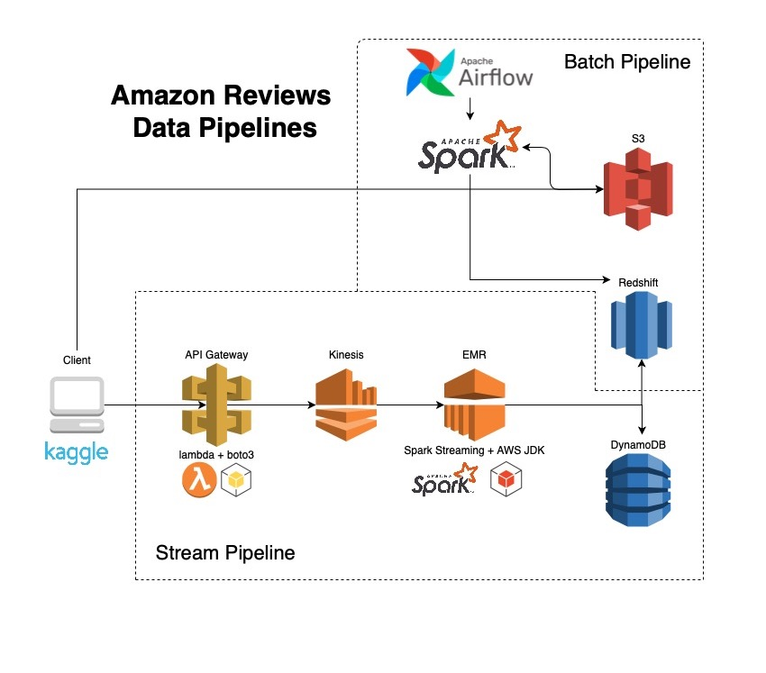

# amazon-reviews

## Motivation

Amongst every three American households, one holds an Amazon Prime account; I am part of
the one. With Amazon’s ever-expanding options, great prices and convenience, it’s hard not to
be dependent on its services and products. And with a customer and merchant base of its
caliber, one of the most reliant focal points I personally utilize is Amazon’s product reviews.

From personal experiences, when I’m looking for new products, I find myself immersed, for
hours at times, into all the available reviews from previous customers to ensure I am getting my
money’s worth; other times, it’s for the pure humor hidden among the reviews. These reviews,
although written by strangers from all over the world, provide me with the confidence within
the product I want to purchase. A trust system that we inversely placed upon each other as
users within the same platform.

As a huge data nerd, my personal engagement this process intrigued me in Amazon’s process of
managing their millions of transactions per day and how they can use their data to bridge
communication from its consumers to its corresponding business stakeholders. As with most
things, the best way to answer my own questions, is to get my hands into the nitty gritty. I
wanted to design my own data ecosystem to set up proper pipelines for analytics and other
business use-cases as a better way of understanding Amazon’s way of functionality and how
the reliant nature of customer feedback, such as in forms of reviews, can be utilized by the rest
of the clientele base and the business itself.

## Overview

**Stream Pipeline**

This pipeline simulates real-time data processing when a client leaves a review for an amazon product. As a result of the transaction, a JSON string, containing all of the review data, would be posted to an API Gateway endpoint. This would trigger a lambda function to send data to Kinesis' AmazonReviews-APIData datastream. Kinesis would buffer this data in shards, and the order of these shards would be stored in a temporary table in DynamoDB to prevent duplicative data processing. A Spark Streaming application, hosted in EMR, would then pick up this data and transform it DF, which would then be written in Redshift and DynamoDB.

**Batch Pipeline**

If there are historical records that were not captured by the stream pipeline, data could be captured using this pipeline. A client would send a csv containing review data to a S3 bucket. Airflow, once a day, will trigger an amazon-review-batch spark job, which will look for new csv's in the S3 bucket, process them, and store in Redshift.

## Environments/Hooks
To enforce portability, this repo utilizes conda/sbt to manage all dependecies.
Also, several pre-commit hooks are used to enforce code consistency:

python hooks
1. black - code formatter
2. isort - sorts import modules
3. flake8 - code linting

scala hooks
1. sbt-scalafmt - code formatter
2. sbt-wartremover - code linting

## Improvements
1. Dockerize airflow job, making it easier to deploy
2. Include step in batch processing to create an EMR cluster to do spark job on the cloud instead of locally
3. Link redshift to a BI tool (ie. Tableau) to visualize results